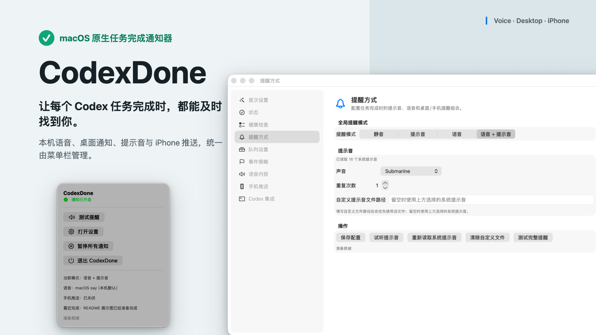
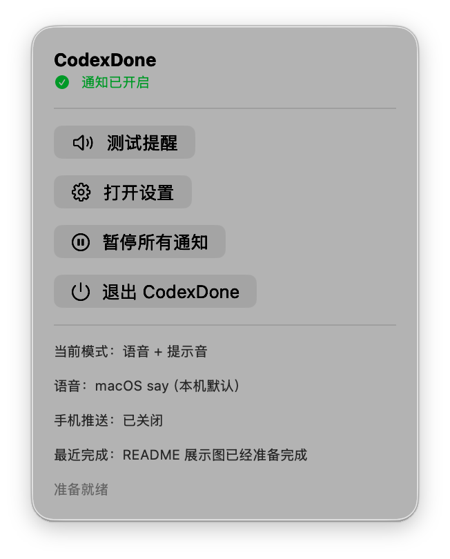

# CodexDone

CodexDone is a macOS-first task completion notifier for Codex workflows.

When a Codex task reaches a stage boundary or final reply, Codex can run `codex-done` to trigger local voice, desktop notifications, and optional mobile push notifications.

<p align="center">
  
</p>

## Features

- macOS `say` voice announcements
- macOS Notification Center desktop notifications
- Optional ntfy or Apple Messages mobile push notifications
- Menu bar app with a settings window
- Web Preview / debug panel for local configuration
- Custom voice message templates
- macOS system voice and sound selection
- Optional OpenAI TTS voice generation with local fallback
- Event-specific notification policies
- Queue merging for multiple concurrent Codex threads
- Health check panel for local dependencies and configuration

## Preview

<p align="center">
  
</p>

## Quick Start

Clone the repository:

```bash
git clone https://github.com/heng8886/codexdone.git
cd codexdone
```

Run the CLI notifier:

```bash
./codex-done
./codex-done "代码修改完成，测试已通过"
./codex-done --status
./codex-done --disable
./codex-done --enable
```

`--disable` pauses every CodexDone channel immediately, including calls from already-open Codex tasks. It keeps the Codex hook installed and exits successfully without recording an event, playing audio, showing a desktop notification, or sending mobile push. `--enable` resumes notifications and `--status` prints `enabled` or `disabled`.

Recommended install for this Mac:

```bash
scripts/install.sh
```

You can also double-click `install-codexdone.command` in Finder.

This installs the global CLI, connects the user-level Codex notify hook, adds the global CodexDone rule, builds the app when possible, and opens CodexDone.

To safely disable the global hook and restore Codex behavior:

```bash
scripts/uninstall.sh
```

You can also double-click `uninstall-codexdone.command` in Finder.

The uninstall script preserves `~/.codex-done` user settings, API key storage, event logs, and runtime state.

The app opens to a first-run setup guide with checks for the CLI, Codex hook, wrapper logs, full reminder test, and optional mobile push setup.

Start the Web Preview:

```bash
scripts/start-codexdone-web-preview.sh
```

Then open:

```text
http://127.0.0.1:51429
```

Build and open the macOS app:

```bash
scripts/build-codexdone-app.sh
open dist/CodexDone.app
```

## Codex Integration

For one project, add this rule to that project's Codex working instructions:

```text
When you complete a stage of work and are about to reply, if the current project contains `codex-done`, `scripts/codex-done.sh`, or a globally available `codex-done` command, run it before the final reply. Use one short sentence to summarize the completed work. If the notification command is missing or fails, do not interrupt the task; reply normally.
```

For all future Codex threads on the same machine, install `codex-done` globally and add a similar rule to your global Codex instructions, such as `~/.codex/AGENTS.md`:

```text
Whenever you complete a stage of work and are about to send the final reply, run `codex-done` if it is available. Use one short sentence to summarize what was completed. If the notification command is unavailable or fails, reply normally and mention the notification failure briefly.
```

Already-open Codex threads may not reload global instructions immediately. Send them a reminder or start a new thread after updating the global instruction file.

The macOS app includes a safety switch on the Codex Integration page. It can enable or disable the user-level global hook without changing Codex app binaries or deleting CodexDone itself. The same page also includes link diagnostics for the global hook: it parses the `notify` route, shows recent wrapper logs, and can run a local hook self-test.

The menu bar also has a notification master switch. This is separate from the hook safety switch: pausing notifications keeps the integration installed but makes every `codex-done` completion call silent. Choosing “退出 CodexDone” offers either closing only the settings interface or pausing all notifications before exit. Closing only the interface leaves CLI notifications active by design.

Example:

```bash
./codex-done "本阶段工作已经完成"
./codex-done --event testPassed "测试已通过"
./codex-done --event testFailed "测试失败，需要查看日志"
./codex-done --event needsAttention "需要你确认下一步"
```

## Configuration

CodexDone stores user configuration outside the repository:

```text
~/.codex-done/config.json
~/.codex-done/env
~/.codex-done/events.jsonl
~/.codex-done/notify-state.json
```

The repository does not include personal config files, event logs, API keys, or local runtime state.

### Mobile Push

CodexDone supports two mobile push providers.

For ntfy, set a topic in the app, Web Preview, or environment:

```bash
export CODEX_NOTIFY_TOPIC=<your-ntfy-topic>
export CODEX_NOTIFY_TITLE="Codex 任务完成"
```

You can also use a full ntfy URL:

```text
https://ntfy.sh/<your-ntfy-topic>
```

For Apple Messages / iMessage, choose that provider in the app or Web Preview and set a recipient phone number or Apple ID. You can also use an environment variable:

```bash
export CODEX_NOTIFY_RECIPIENT="<phone-or-apple-id>"
```

Apple Messages uses the macOS Messages app through AppleScript. The first run may ask macOS for permission to control Messages.

### OpenAI TTS

OpenAI TTS is optional. If enabled and available, CodexDone uses generated speech first and falls back to local macOS `say` when needed.

Configure the key through the app, Web Preview, or environment:

```bash
export OPENAI_API_KEY=<your-openai-api-key>
```

Keys saved through the app or Web Preview are written to the local env file and are not committed to Git.

## Voice Templates

Voice, desktop, and mobile notification messages can use templates:

```text
{project}
{message}
{time}
{event}
{eventType}
{taskId}
{threadId}
```

Default app template:

```text
{project}: {message}
```

## Project Structure

```text
CodexDoneApp/        SwiftPM macOS menu bar app and shared core
CodexDoneWebPreview/ Local Node.js Web Preview and API server
codex-done           CLI notifier script
scripts/             Build, install, and local service helpers
tests/               Shell behavior tests
docs/                Detailed usage and implementation notes
```

## Development

Run checks:

```bash
node --check CodexDoneWebPreview/server.js
node --check CodexDoneWebPreview/public/app.js
bash -n codex-done
bash -n tests/test_codex_done.sh
bash tests/test_codex_done.sh
bash tests/test_install_scripts.sh
bash tests/test_swift_config.sh
bash tests/test_web_config.sh
swift build --package-path CodexDoneApp
```

Build the app bundle:

```bash
scripts/build-codexdone-app.sh
```

Create a release zip and checksum:

```bash
scripts/package-release.sh v0.1.0
```

## Security Notes

- Do not commit `~/.codex-done/env`, API keys, personal topics, or event logs.
- Generated app bundles, Swift build output, local logs, and runtime pid files are ignored by `.gitignore`.
- Use placeholder values in documentation and tests.
- Review changes before publishing because this repository is public.

## Status

This is an MVP focused on macOS. The current runtime supports macOS `say`, desktop notifications, ntfy push, Apple Messages push, OpenAI TTS fallback behavior, a menu bar app, and a local Web Preview.
